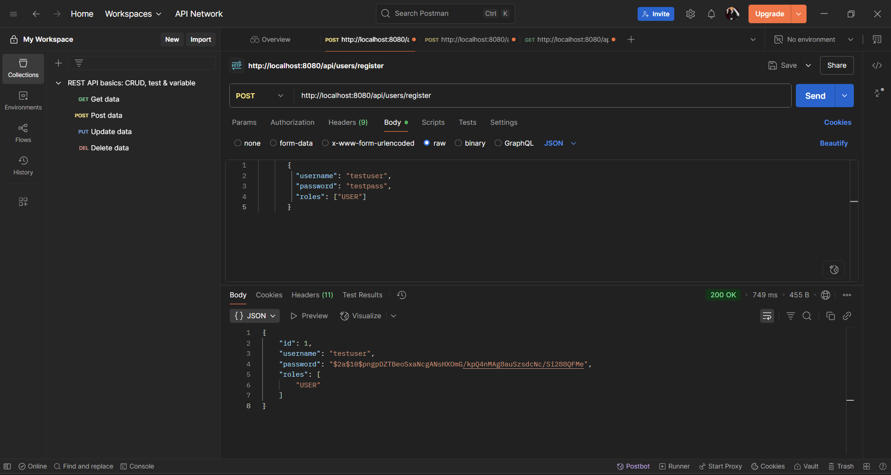
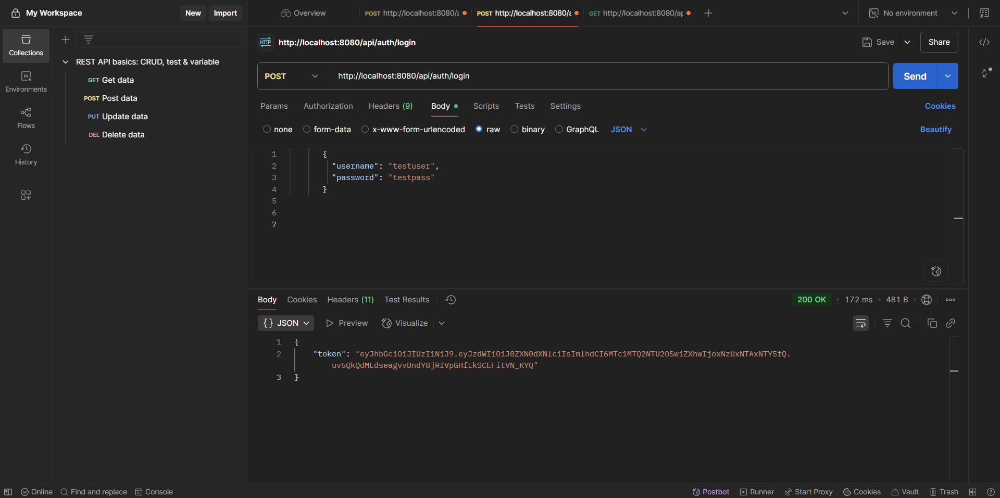
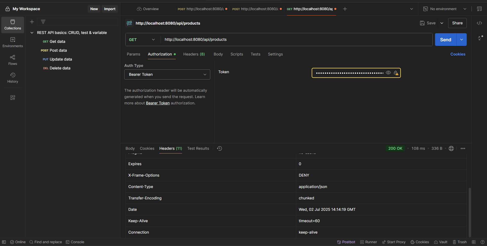

<p align="center">
  
  <br/>
  <b>User Registration API in Postman</b>
</p>
<p align="center">
  
  <br/>
  <b>User Login API in Postman</b>
</p>
<p align="center">
  
  <br/>
  <b>Get Products API in Postman</b>
</p>

# Java E-commerce Backend

A professional, production-ready e-commerce backend built with Java, Spring Boot, and MySQL. This project provides secure REST APIs for user management, product catalog, shopping cart, and order processing, following best practices in architecture and security.

---

## Table of Contents

- [Overview](#overview)
- [Features](#features)
- [Architecture](#architecture)
- [Tech Stack](#tech-stack)
- [Project Structure](#project-structure)
- [Database Schema](#database-schema)
- [API Endpoints](#api-endpoints)
- [Authentication & Security](#authentication--security)
- [Setup & Installation](#setup--installation)
- [Usage](#usage)
- [Future Improvements](#future-improvements)
- [License](#license)

---

## Overview

This project is a backend system for an e-commerce platform, designed to handle user registration and authentication, product management, shopping cart operations, and order processing. It uses JWT for stateless authentication and follows a layered architecture for maintainability and scalability.

---

## Features

- **User Registration & Login:** Secure sign-up and login with password hashing (BCrypt) and JWT token issuance.
- **Product Management:** CRUD operations for products (add, update, delete, list).
- **Shopping Cart:** Users can add, update, or remove products in their cart.
- **Order Processing:** Users can place orders, view order history, and see order details.
- **Role-based Security:** Only authenticated users can access protected endpoints.
- **Stateless Authentication:** Uses JWT tokens for secure, scalable session management.
- **Clean Architecture:** Layered structure (Controller, Service, Repository) for separation of concerns.
- **RESTful API:** Follows REST conventions for all endpoints.

---

## Architecture

```
Client (Postman/Frontend)
        |
        v
[Controller Layer] <--- REST API Endpoints
        |
        v
[Service Layer]    <--- Business Logic
        |
        v
[Repository Layer] <--- Data Access (JPA/Hibernate)
        |
        v
     [MySQL]
```

- **Security Layer:** Intercepts requests, validates JWT tokens, and manages authentication.
- **Stateless:** No server-side sessions; all authentication is via JWT.

---

## Tech Stack

- **Language:** Java 17+
- **Framework:** Spring Boot
- **Database:** MySQL
- **ORM:** Spring Data JPA (Hibernate)
- **Security:** Spring Security, JWT, BCrypt
- **Build Tool:** Maven

---

## Project Structure

```
src/main/java/com/ecommerce/
│
├── controller/
│   ├── AuthController.java
│   ├── UserController.java
│   ├── ProductController.java
│   ├── CartController.java
│   └── OrderController.java
│
├── model/
│   ├── User.java
│   ├── Product.java
│   ├── Cart.java
│   ├── CartItem.java
│   ├── Order.java
│   └── OrderItem.java
│
├── repository/
│   ├── UserRepository.java
│   ├── ProductRepository.java
│   ├── CartRepository.java
│   ├── CartItemRepository.java
│   ├── OrderRepository.java
│   └── OrderItemRepository.java
│
├── service/
│   ├── UserService.java
│   ├── ProductService.java
│   ├── CartService.java
│   ├── OrderService.java
│   └── impl/
│       ├── UserServiceImpl.java
│       ├── ProductServiceImpl.java
│       ├── CartServiceImpl.java
│       └── OrderServiceImpl.java
│
├── security/
│   ├── SecurityConfig.java
│   ├── JwtAuthenticationFilter.java
│   ├── JwtUtil.java
│   └── CustomUserDetailsService.java
│
└── ECommerceBackendApplication.java
```

---

## Database Schema

- **User:** id, username, email, password, roles
- **Product:** id, name, description, price, stock
- **Cart:** id, user_id, [CartItems]
- **CartItem:** id, cart_id, product_id, quantity
- **Order:** id, user_id, order_date, total_amount, [OrderItems]
- **OrderItem:** id, order_id, product_id, quantity, price

---

## API Endpoints

### **Authentication**
- `POST /api/users/register` — Register a new user
- `POST /api/auth/login` — Login and receive JWT token

### **User**
- `GET /api/users/me` — Get current user profile (protected)

### **Product**
- `GET /api/products` — List all products
- `GET /api/products/{id}` — Get product by ID
- `POST /api/products` — Add new product (protected)
- `PUT /api/products/{id}` — Update product (protected)
- `DELETE /api/products/{id}` — Delete product (protected)

### **Cart**
- `GET /api/cart` — Get current user's cart (protected)
- `POST /api/cart/add` — Add product to cart (protected)
- `PUT /api/cart/update` — Update cart item quantity (protected)
- `DELETE /api/cart/remove/{itemId}` — Remove item from cart (protected)

### **Order**
- `POST /api/orders` — Place an order (protected)
- `GET /api/orders` — Get user's order history (protected)
- `GET /api/orders/{id}` — Get order details (protected)

> **Note:** All protected endpoints require a valid JWT token in the `Authorization: Bearer <token>` header.

---

## Authentication & Security

- **Password Hashing:** All passwords are hashed using BCrypt before storage.
- **JWT Authentication:** On login, users receive a JWT token to access protected endpoints.
- **Stateless:** No server-side sessions; all authentication is via JWT.
- **Spring Security:** Configured to restrict access to sensitive endpoints.

---

## Setup & Installation

1. **Clone the repository:**
   ```bash
   git clone https://github.com/yourusername/e-commerce-backend.git
   cd e-commerce-backend
   ```

2. **Configure the database:**
   - Create a MySQL database (e.g., `ecommerce_db`).
   - Update `src/main/resources/application.properties` with your DB credentials.

3. **Build the project:**
   ```bash
   mvn clean install
   ```

4. **Run the application:**
   ```bash
   mvn spring-boot:run
   ```

5. **API Testing:**
   - Use Postman or curl to test endpoints.
   - Register a user, login to get a JWT, and use the token for protected endpoints.

---

## Usage

- **Register:**  
  `POST /api/users/register` with JSON body `{ "username": "...", "email": "...", "password": "..." }`
- **Login:**  
  `POST /api/auth/login` with JSON body `{ "username": "...", "password": "..." }`  
  → Returns JWT token.
- **Use JWT:**  
  Add header `Authorization: Bearer <token>` to all protected requests.

---

## Future Improvements

- Add user roles (admin, customer) and role-based access control
- Implement product categories and search
- Add order payment and shipment tracking
- Integrate with a frontend (React, Angular, etc.)
- Add automated tests (unit/integration)
- Deploy to cloud (AWS, Azure, Heroku)

---

## License

This project is open-source and available under the [MIT License](LICENSE). 